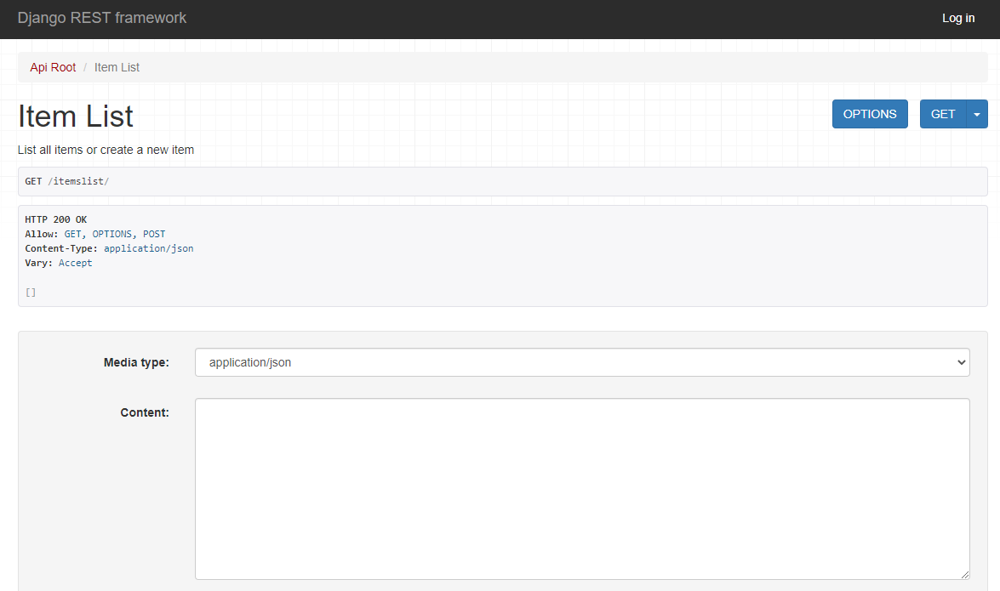

## AWS Docker Templates - Django

The AWS Docker Templates for Django from TinyStacks enable launching a [Django](https://www.djangoproject.com/) application as a Docker container using AWS CodePipeline. The template includes its own small Django sample application, enabling developers to start a new Django project immediately. Developers can also take the AWS CodePipeline-specific files in this template and use them to ship an existing Django application as a Docker image on AWS. 

## License

This sample code is made available under a BSD 3-Clause license. See the LICENSE file.

## Outline

- [Prerequisites](#prerequisites)
- [Overview](#overview)
  - [Sample Application](#sample-application)
  - [Running the Django Server Directly](#running-the-django-server-directly)
  - [Dockerfile](#dockerfile)
  - [Build Template](#build-template)
  - [Release Template](#release-template)
- [Getting Started](#getting-started)
  - [Existing Project](#existing-project)
- [Known Limitations](#known-limitations)

## Prerequisites

This solution makes use of a Docker image that comes with Python pre-installed; Django dependencies are installed dynamically when the Docker container is created. If you wish to run just the Docker container locally, you will only need Docker.

If you wish to build and test the Django application directly on your own machine (i.e., not from a Docker container), you should have [Python](https://www.python.org/downloads/) installed locally.

This document also assumes that you have access to an AWS account. If you do not have one, [create one before getting started](https://aws.amazon.com/premiumsupport/knowledge-center/create-and-activate-aws-account/).

Further prerequisites for running these templates on AWS are provided below.

## Overview

Django is a Python framework for developing Web applications. With Django, developers can quickly create object-relational database mappings, REST APIs, user front ends, and even administrative interfaces. Django implements a Model-View-Controller (MVC) pattern that separates the application's data (model) from its user interface (view) and business logic (controller), making it easy to write cleanly structured code. 

This template augments the existing power of Django by packaging your Django app into a Docker image, which can then be deployed onto AWS CodePipeline in a few simple steps. You can fork this repo into your own GitHub account and any changes you make to your Django application will automatically be updated via CodePipeline within minutes. 

This sample contains the following files: 

* A sample Django API and data model, defined in the directory `itemslist`.
* The API and admin entry points for the Django app, defined in the directory `itemsAPP`.
* A `wsgi.py` file (in the `itemsAPP` directory) for running your Django application on your Docker image using [WSGI](https://docs.djangoproject.com/en/3.2/howto/deployment/wsgi/). 
* A `Dockerfile` that builds the Django application as a Docker image. 
* A `requirements.txt` file that enables the Dockerfile to install Django and other dependencies via the [`pip`](https://docs.python.org/3/installing/index.html) command. 
* A `manage.py` file for executing Django administrative tasks from the command line. 
* A `build.yml` file for AWS CodeBuild that builds the image and pushes it to Amazon Elastic Container Registry (ECR). 
* A `release.yml` file for AWS CodeBuild that deploys the image stored in ECR to a Amazon Elastic Container Service (ECS) cluster. 

Users can use the `build.yml` and `release.yml` YAML files to create an AWS CodePipeline pipeline that compiles the latest application into a Docker image, which is then stored in an Amazon Elastic Container Registry (ECR) registry that is accessible to the user. The Django application itself is deployed onto AWS as a Docker container using Amazon Elastic Container Service (Amazon ECS) onto one of the user's available ECS clusters. 

### Sample Application

The sample application is a simple CRUD (Create/Read/Update/Delete) application that stores data in a local SQLite database (the default data storage method for Django). When this application runs, it presents a set of REST API endpoints that other applications can call to store data. 

The application is defined in the `itemslist` directory. The file `models.py` defines the databsse schema for an item, which consists of two fields: `title` and `content`.

```python
from django.utils import timezone
class ItemList(models.Model):
    title = models.CharField(max_length=250) # a varchar
    content = models.TextField(blank=True) # a text field 
    class Meta:
        verbose_name = ("Item")
        verbose_name_plural = ("Items")
    def __str__(self):
        return self.title # name to be shown when called
```

The application uses the [Django REST Framework](https://www.django-rest-framework.org/) to define REST API functions in the `views.py` file. Two sets of API functions are defined. First, we define [ViewSets](https://www.django-rest-framework.org/api-guide/viewsets/) for the `ItemList` class that we defined in our model. We also define ViewSets for the built-in Users and Groups objects in Django, which are used to implement a user authorization model. 

```python
class ItemViewSet(viewsets.ModelViewSet):
    """
    API endpoint that allows items to be viewed or edited.
    """
    queryset = ItemList.objects.all()
    serializer_class = ItemSerializer
    permission_classes = [permissions.IsAuthenticated]
```

Second, we use the [`@api_view`](https://www.django-rest-framework.org/api-guide/views/#api_view) decorator to declare some more advanced API functions such as the `item_list` view to view a list of items or to create a new item. The `/itemslist` REST method supports all possible CRUD operations for our application by implementing them as their respective HTTP verbs: 

| Endpoint Type  | Description |
| ------------- | ------------- |
| PUT  | Create  | 
| GET | Read  |
| POST  | Update  |
| DELETE  | Delete  |

To expose these methods publicly in Django as API endpoints, we must define *routes* (URL paths) that map to the functions. These are defined in `itemsAPP\urls.py`: 

```python
urlpatterns = [
    path('', include(router.urls)),
    path('ping', include(router.urls)),
    path('api-auth/', include('rest_framework.urls', namespace='rest_framework')),
    path('', include(router.urls)),
    url(r'^admin/', admin.site.urls),
    url(r'^$', index, name="ItemList"),
    path('itemslist/', views.item_list),
    path('itemslist/<int:pk>', views.item_detail),
```

### Running the Django Server Directly

To test out the sample application directly before you package it into a Dockerfile, clone this project locally, then create a virtual environment. Using a virtual environment allows you to install the dependencies required for Django relative to your Django application. This isolates the Django dependencies from other libraries installed on your system, reducing version conflicts across Python applications. 

```
python -m venv venv
```

Next, activate your virtual environment and run the Django application. To run the Django application, we use the manage.py file, which was automatically generated by the Django framework when we created our Django application and provides a set of commands for managing our environment easily. (For more on creating Django applications, [see the official documentation](https://docs.djangoproject.com/en/3.2/intro/tutorial01/).)

On Linux:

```
. venv/bin/activate

pip install -r requirements.txt

python manage.py migrate
python manage.py runserver
```

On Windows (Powershell):

```
venv\Scripts\activate

pip install -r requirements.txt

python manage.py migrate
python manage.py runserver
```

To test that the server is running, test its `/ping` endpoint from your Web browser by navigating to `http://127.0.0.1:8000/ping`. If the server is running, this call will return a pretty-printed page displaying the authenticated API endpoints for your Django application: 


To use the unauthenticated endpoint, navigate to `http://127.0.0.1:8000/itemslist`:



*Note*: If you encounter an error  when navigating to this page, return to the command line, press CTRL-C, and run the following command: 

```
python manage.py migrate --run-syncdb
```

Then restart your Django server: 

```
python manage.py runserver
```

You can use Django's built-in administration UI to view, add, and delete items. 

### Dockerfile

The Dockerfile copies the sample application into a Docker image and runs a Django server. 

A Dockerfile uses a Docker base image stored in a public Docker repository and then adds functionality to the image required by your application. This project's Dockerfile is derived from [Bitnami's Python 3.6 image](https://gallery.ecr.aws/bitnami/python), which is freely available on the [Amazon ECR Public Gallery](https://gallery.ecr.aws/). The Dockerfile performs the following steps: 

* Copies the Django application into a working directory on the Docker image. 
* Installs the contents of the `requirements.txt` file using pip. Requirements.txt contains a list of the Python modules that are required to run your Django application. The file included with this project installs Django; [the Django REST Framework](https://www.django-rest-framework.org/); and [whitenoise](http://whitenoise.evans.io/en/stable/), a package that enables serving static Web site content efficiently.
* Starts Django through the `runserver` command defined in the auto-generated `manage.py` file. 

If you have Docker installed, you can build and try out the sample application locally. Open a command prompt to the directory containing the Dockerfile and run the following command: 

```
docker build -t tinystacks/django-crud-app:latest .
```

Once built, run the Docker command locally, mapping port 8080 on your host machine to port 80 on the container: 

```
docker run -p 8080:80 -d tinystacks/django-crud-app:latest
```

To test that the server is running, test its `/ping` endpoint by navigating to `http://127.0.0.1:8080/ping` from a Web browser. You should see the same page you saw earlier when running Django locally. 

### Build Template

The `build.yml` file is an AWS CodeBuild file that builds your Dockerfile and publishes the output to an Amazon ECR registry. 

To publish to Amazon ECR, the build script first needs to obtain login credentials to the repository. It does this using a combination of the AWS CLI command `aws ecr get-login-password` and the `docker login` command. After authentication, the script then builds your Docker image, names it, and tags it with the name `latest` to mark it as the most recent build. Finally, it performs a `docker push`, publishing the new Docker image to your Amazon ECR Docker repository.

```yml
version: 0.2
phases:
  build:
    commands:
      - aws ecr get-login-password --region $AWS_REGION | docker login --username AWS --password-stdin $ECR_ENDPOINT
      - docker build -t builtimage .
      - docker tag builtimage:latest $ECR_IMAGE_URL:latest
      - docker push $ECR_IMAGE_URL:latest
```

To run this in AWS CodeBuild, your build pipeline needs to define the following environment variables: 

* **ECR_ENDPOINT**: The name of the Amazon ECR repository to publish to. This variable takes the format: *&lt;accountnumber&gt*.dkr.ecr.*&lt;aws-region&gt;*.amazonaws.com
* **ECR_IMAGE_URL**: The name of the Amazon ECR repository plus the name of the container you are publishing. This should take the format: *&lt;accountnumber&gt;*.dkr.ecr.*&lt;aws-region&gt;*.amazonaws.com/aws-docker-django

The variable `AWS_REGION` is a default global variable that will default to the same AWS region in which your build pipeline is defined. If you need to publish to an Amazon ECR repository in another region, modify this script to use a custom environment variable specifying the correct region. For more information on environment variables, see [Environment variables in build environments](https://docs.aws.amazon.com/codebuild/latest/userguide/build-env-ref-env-vars.html) on the AWS Web site. 

### Release Template

The `release.yml` file is another AWS CodeBuild file that takes the build output from the `build.yml` files (a Docker container image in an Amazon ECR repository) and runs it within an Amazon ECS cluster to which the pipeline has access. 

After logging in to the ECR repository using the `docker login` command, the script pulls down the image that was compiled and changes its tag from the name of the previous build to the name of the new build. Once the container's label has been updated, the script updates a defined service in Amazon ECS that pulls its image from our published Docker container. 

```yaml
version: 0.2
phases:
  build:
    commands:
      - aws ecr get-login-password | docker login --username AWS --password-stdin $ECR_ENDPOINT
      - docker pull $ECR_IMAGE_URL:$PREVIOUS_STAGE_NAME
      - docker tag $ECR_IMAGE_URL:$PREVIOUS_STAGE_NAME $ECR_IMAGE_URL:$STAGE_NAME
      - docker push $ECR_IMAGE_URL:$STAGE_NAME
      - aws ecs update-service --service $SERVICE_NAME --cluster $CLUSTER_ARN --force-new-deployment
```

In addition to the variables discussed for `build.yml`, `release.yml` requires several environment variables defined in order to run: 

* **PREVIOUS_STAGE_NAME**: The previous build number or build stage name. This should be the previous Docker image tag name generated by the previous build.
* **STAGE_NAME**: The current build number or build stage name you wish to use (e.g., `latest`). 
* **SERVICE_NAME**: The name of the Amazon ECS service to run. You will need to define this service yourself once you have the URI to your published container. 
* **CLUSTER_ARN**: The name of the cluster within your Amazon ECS service to which the release script will deploy the container. This should be the name of a custer that is running one or more instances of the service referenced by `SERVICE_NAME`. 

## Getting Started

### Existing Project

If you already have an existing Django application, you can use the core files included in this sample to run them on a Docker container in AWS. Make sure to use your own existing requirements.txt file if you have one. 

If your project is already Dockerized (i.e., it has its own Dockerfile), then simply copy over the `build.yml` and `release.yml` files into the root of your existing project. 

If your project is not Dockerized, you will also need to copy over the Dockerfile included in this sample. If your application uses a different port than port 80, you will also need to update the `EXPOSE` line in the Dockerfile to use a different port:

```Dockerfile
EXPOSE 80
```

## Known Limitations

The method of running a Django server discussed above is recommended for development purposes only. For shipping a production Django application, the Django team recommends running your server using Gunicorn. For more information, [see Django's guide to production deployments](https://developer.mozilla.org/en-US/docs/Learn/Server-side/Django/Deployment).
